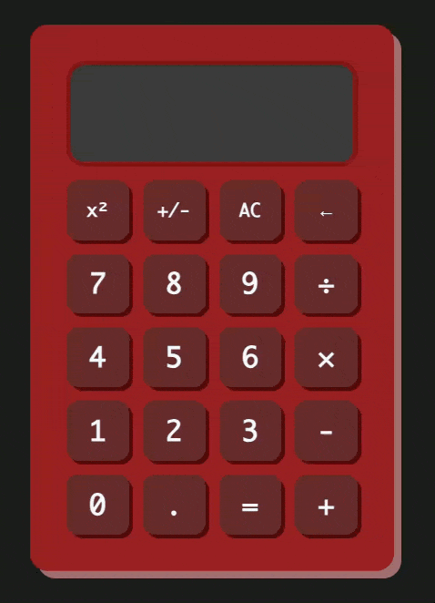

# JavaScript Calculator

A web calculator built with HTML, CSS, and JavaScript. A Project inspired by [The Odin Project](https://www.theodinproject.com/).

## 🕹️ Demo

  
  

    <a href="https://kckhchen.com/js-calculator/"><b>🖥️ Try the Live Demo</b></a>
  

## Features

- **Operator Chaining**: Computes running total as the user presses operator keys.
- **Dark/Light Mode**: Allows dark/light mode toggling.
- **Keybord and Mouse Support**: Supports both keyboard input and mouse clicks on buttons.
- **Adaptive Digit Display**: Automatically adjusts font sizes to fit digits inside the display window.
- **Calculation History**: Stores up to 20 past entries in an expandable list. Clicking on a historical entry brings to answer to the display.
- **Click to Copy**: Click display to copy current text.
- **Clicky Buttons**: Buttons play nice sounds when clicked!
- **Looks Great on Mobiles Too!**

## ⌨️ Keyboard Shortcuts

| Key         | Action                |
| :---------- | :-------------------- |
| `0-9`       | Input Numbers         |
| `+ - * /`   | Operators             |
| `Enter`     | Calculate (=)         |
| `Backspace` | Delete Last Digit (←) |
| `Escape`    | All Clear (AC)        |
